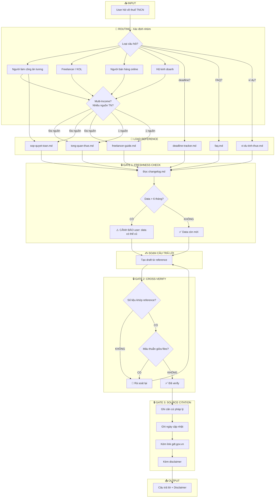
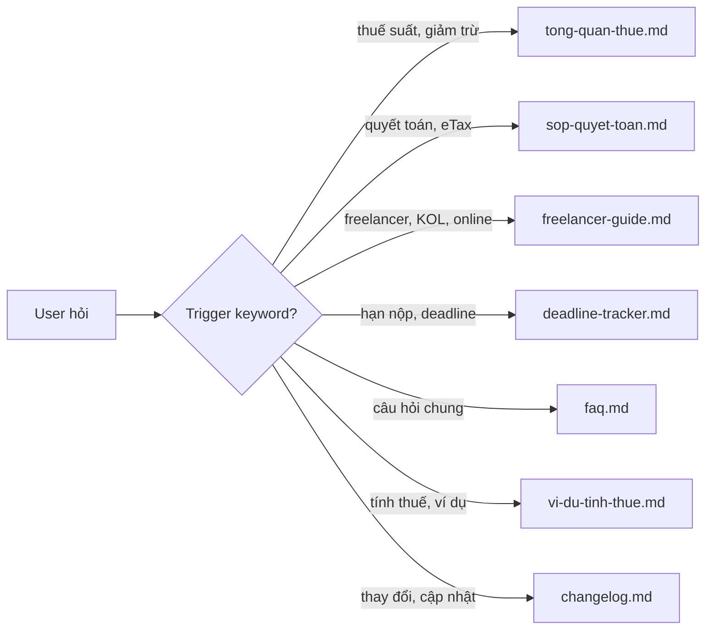
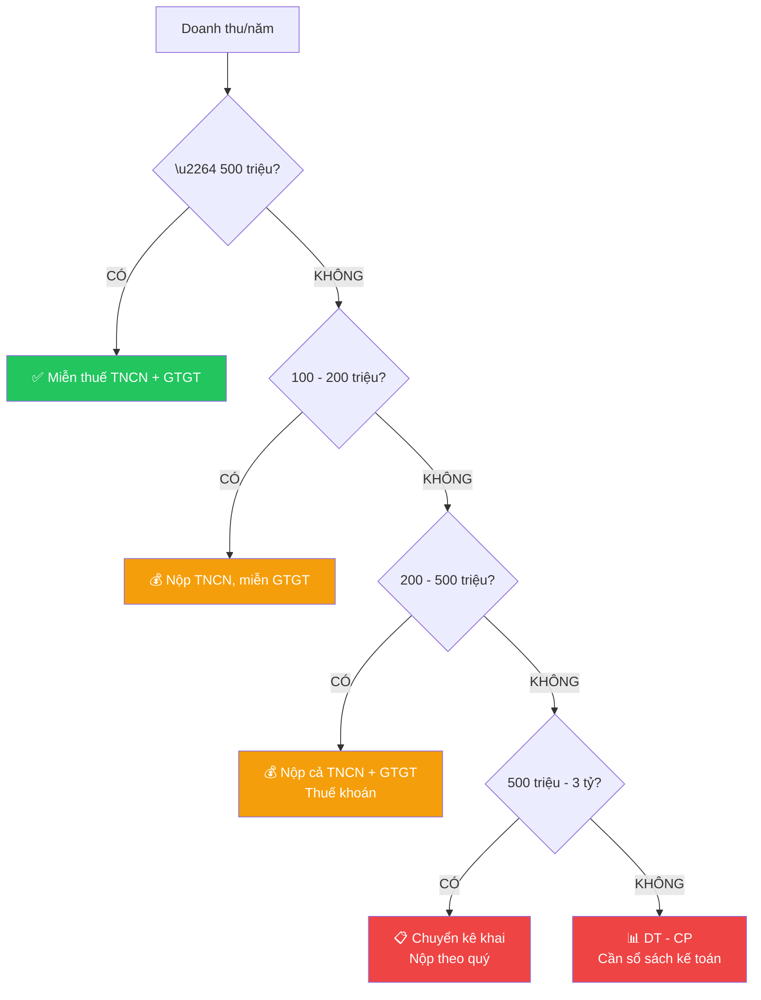
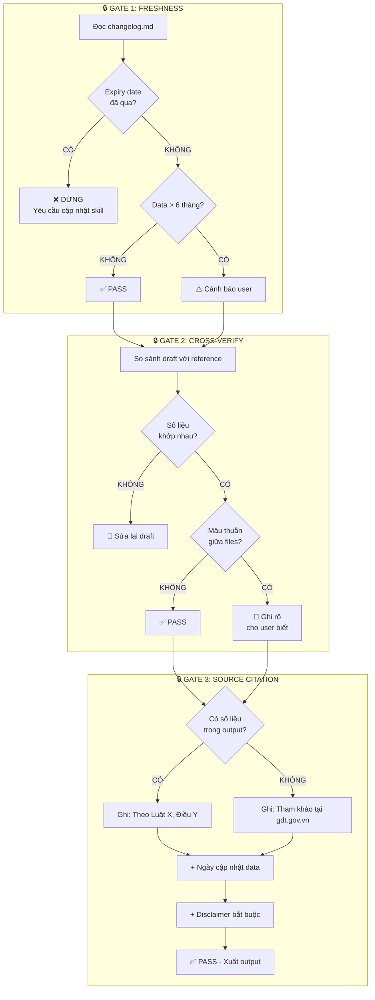
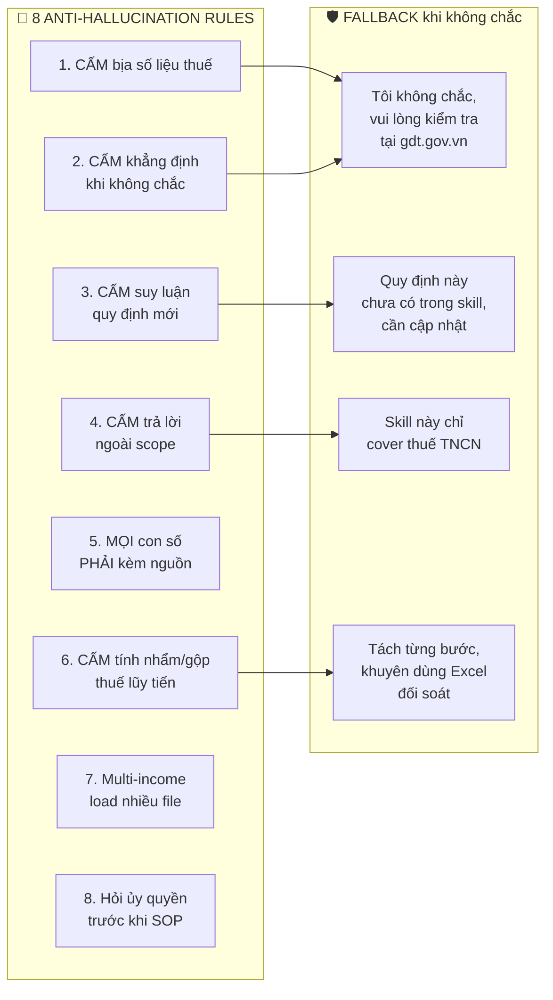
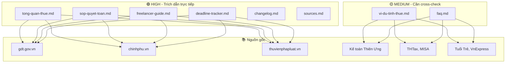

# System Flow - Thuế TNCN Vietnam Skill

> **Version:** 1.6.0 | **Cập nhật:** 07/04/2026

## Tổng Quan Hệ Thống

## Chi Tiết Từng Bước

### Bước 1: Nhận câu hỏi & Routing

### Bước 2: Xác định ngưỡng doanh thu (Decision Tree)

### Bước 3-5: Verification Gate Flow

### Anti-Hallucination Guard

## Confidence Level Map

## Tóm Tắt Quy Trình

| Bước | Hành động | Gate | Nếu FAIL |
|------|----------|------|---------|
| 1 | Nhận câu hỏi, detect trigger | - | - |
| 2 | Routing -> nhóm đối tượng | - | - |
| 3 | Load reference file | - | - |
| 4 | Kiểm tra freshness | 🔒 Gate 1 | Cảnh báo hoặc DỪNG |
| 5 | Soạn câu trả lời | - | - |
| 6 | Cross-verify số liệu | 🔒 Gate 2 | Sửa lại hoặc ghi mâu thuẫn |
| 7 | Trích nguồn + disclaimer | 🔒 Gate 3 | KHÔNG được bỏ qua |
| 8 | Output cho user | - | - |
